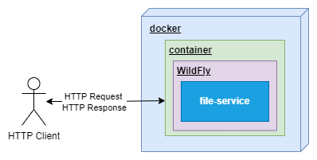

:toc: left
:toclevels: 4
:sectnums:
:sectnumlevels: 4
:source-highlighter: rouge
:rouge-style: thankful_eyes
:icons: font

= file-module

A file module application based on Jakarta and
Wildfly technology, which can be integrated
into applications capable of HTTP-based communication.

It stores the files in the physical storage.

== Architecture

The main usage model for how the file-service should be used
is illustrated in the following diagram:

== Endpoints

=== POST /rest/file-service/upload

*Summary:* Upload file

*Description:* Endpoint for uploading files.
It stores the file in physical storage and creates
the necessary entries in the database.
Possible additional error types: `DtoConversionException`.

It stores the file in physical storage.
The storage location is specified in the docker-compose file.

=== GET /rest/file-service/{id}

*Summary:* Get file details

*Description:* Endpoint for getting the details of the file.

*Parameters:*
- __id__: The unique identifier of the document (in path, required, string)

=== PUT /rest/file-service/{id}

*Summary:* Update document details

*Description:* Endpoint for updating the details of the document.

*Parameters:*
- __id__: The unique identifier of the document (in path, required, string)

Only the basic metadata of the file can be modified.
To modify the physical file, the original copy must
be deleted and the modified file must be uploaded as a new copy.

=== DELETE /rest/file-service/{id}

*Summary:* Delete file

*Description:* Endpoint for deleting the file and the details of the document.

*Parameters:*
- __id__: The unique identifier of the document (in path, required, string)

=== GET /rest/file-service/{id}/download

*Summary:* Download file

*Description:* Endpoint for downloading the physical file.

*Parameters:*
- __id__: The unique identifier of the document (in path, required, string)

If the file to be downloaded has changed, it returns with a CONFLICT status code.
